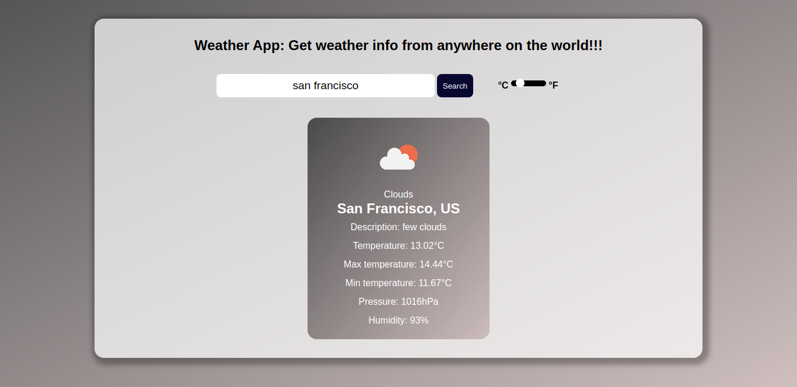

# weather-app

## Project description
This project is an implementation of a weather app.

This project was done mainly for learning purposes, the aim was to practice using javascript async/await and working with APIs using fetch method. The project's specifications are listed on [The odin project](https://www.theodinproject.com/courses/javascript/lessons/weather-app)

## Screenshot

## Built with
- HTML5
- CSS3
- Vanilla Javascript
- Webpack

## Features
  - Search the weather info of any city on the earth
  - Convert the gotten result from degrees celcius to fahreneit

## Deployment
- [Weather app on netlify](https://weather-app-descholar.netlify.app)
- [Weather app on heroku](https://weather-app-descholar.heroku.com)

## Running and testing it locally

### Prerequisites
- [NodeJS](https://nodejs.org/)
- [Yarn](https://yarnpkg.com/) or just the default npm which comes with NodeJS

### Setup
- Run `git clone https://github.com/descholar-ceo/weather-app && cd weather-app` to get a copy of source codes on your local computer and to navigate inside the project directory
- Run `yarn install`
- Run `yarn build`
- Create a file called `.env` add `PORT` in the same format of `.env.example`

### Usage
- Run `yarn start` or `npm start` to start this project 
- Go in the browser and access it on `localhost:<PORT_YOU_PRECISED_IN_ENV_FILE>`

### Tests
- No test yet

## Contributions

There are two ways of contributing to this project:

1.  If you see something wrong or not working, please check [the issue tracker section](https://github.com/descholar-ceo/weather-app/issues), if that problem you met is not in already opened issues then open a new issue by clicking on `new issue` button.

2.  If you have a solution to that, and you are willing to work on it, follow the below steps to contribute:
    1.  Fork this repository
    1.  Clone it on your local computer by running `git clone https://github.com/your-username/weather-app.git` __Replace *your username* with the username you use on github__
    1.  Open the cloned repository which appears as a folder on your local computer with your favorite code editor
    1.  Create a separate branch off the *master branch*,
    1.  Write your codes which fix the issue you found
    1.  Commit and push the branch you created
    1.  Raise a pull request, comparing your new created branch with our original master branch [here](https://github.com/descholar-ceo/weather-app)

## Author

👤 **Mugirase Emmanuel**

- Github: [@descholar-ceo](https://github.com/descholar-ceo)
- Twitter: [@descholar3](https://twitter.com/descholar3)
- Linkedin: [MUGIRASE Emmanuel](https://www.linkedin.com/in/mugirase-emmanuel)

## Show your support

Give a :star: if you like this project!

## Acknowledgment
- [Microverse](https://www.microvese.org)
* [Webpack](https://webpack.js.org/)
